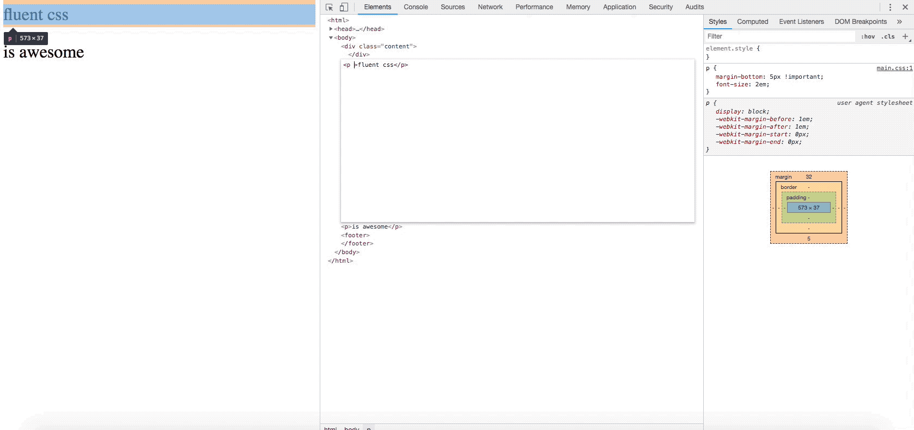


## Create css files
`npm run build`

## Customize output folder

`npm run build --  --output='../css'`

## Start sass watch (not active by default)
`npm run build -- --watch`

## Or just start watching (with all paramters e.g. --gzip)
`npm run watch`

## Deactivate sourcemaps default is true
`npm run build -- --sourcemaps=false`

## Deactivate compression
`npm run build -- --compress=false`

## Build with gzip
`npm run build -- --gzip`

## Or start gzipping (with all paramters e.g. --package)
`npm run gzip -- --clean=false`

## Change output filename
`npm run build -- --filename=main.css`

`npm run build -- --filename=main.scss`

`npm run build -- --filename=main`
### adding `.css` will only create css files. Adding `.scss` will only create scss files, filename without ending will create both, scss and css files.

## Too much? Limit to the packages you need
`npm run build -- --packages='display, position'`

## Deactivate clean
`npm run build -- --clean=false`

## Or just clean up
`npm run clean`

# Combine them!
`npm run build -- --gzip --compress=false --souremap=false --ouput=../ filename=main.css`


# Usage of fluent-css 
 ## to import fluent-css, simply copy this line in your scss stylesheet
```scss
@import 'fluent-css'; // absolute path from your stylesheet e.g. -> ./sass/fluent-styles/fluent-styles;
```

## padding and margin
```html
<div class="padding-px pb-14 pl-14">
	...
</div>

<div class="margin-percent mb-14 ml-14-important">
	...
</div>
```
## Style behind
```scss
.padding-px { 
   &.pb-1 {
      padding-bottom: 1px;
   }

   &.pb-1-important {
      padding-bottom: 1px !important;
   }

   // also with minus for margin (invalid for padding!)
   &.mb-neg-1 {
      margin-bottom: -1px;
   }
}
```

```html
<div class="display-inline-block">
	<!-- easy! right? -->
</div>
```

## Packages
```scss
- margin-padding.scss,
- position.scss,
- z-index.scss,
- display.scss
```

# Example for margin


# Example for padding
