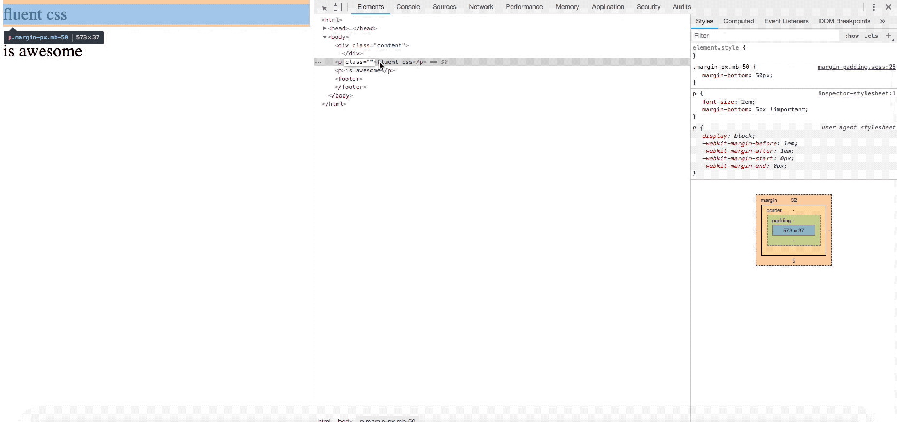

## Navigate in the package folder
`cd node_modules/fluent-css`

## Install dependencies
```scss 
// ../node_modules/fluent-css 
npm install
```

## Create the `fluent-css.json` for your personal settings (will be created in your project-root)```scss 
```scss
// ../node_modules/fluent-css 
npm run init
```

## Create css files
```scss
// ../node_modules/fluent-css 
npm run build
```

# Usage of fluent-css 
 ## to import fluent-css, simply copy this line in your scss stylesheet (or the name you specified)
```scss
@import 'fluent-css'; // absolute path from your stylesheet e.g. -> ./fluent-css/fluent-css by default
```

## padding and margin
```html
<div class="padding-px pb-14 pl-14">
	...
</div>

<div class="margin-percent mb-14 ml-14-important">
	...
</div>
```
## Style behind
```scss
.padding-px { 
   &.pb-1 {
      padding-bottom: 1px;
   }

   &.pb-1-important {
      padding-bottom: 1px !important;
   }

   // also with minus for margin (invalid for padding!)
   &.mb-neg-1 {
      margin-bottom: -1px;
   }
}
```

```html
<div class="display-inline-block">
	<!-- easy! right? -->
</div>
```

# Packages (Work in Progress)

- margin-padding.scss
- border.scss
- position.scss
- display.scss
- z-index.scss
- font.scss
- pointer-events.scss


# Available Classes
## margin-padding.scss
```scss
// units: rem, em, px, percent

.margin-px.m-1 // margin: 1px

.margin-px.mb-1 // margin-bottom: 1px; mb, mt, ml, mr 
.margin-percent.mb-1  // up to 64 .mb-64
.padding-px.mb-1

// !important
.margin-px.mb-1-important

// negative (not valid for padding!)
.margin-px.mb-neg-1
```

## border.scss
```scss
// dotted, dashed, solid, double, groove, ridge, inset, outset, thin, medium, thick, initial, inherit 

.border-1
.border-solid
.border-solid-1 // (1-5)
.border-solid-thin
.border-solid-thin-green // 140 colors
.border-left-1
.border-left-solid
.border-left-solid-1-green
```

## position.scss
```scss

// static, absolute, fixed, relative, sticky, initial, inherit
.position-absolute
.position-absolut-important

// units: rem, em, px, percent
.position-px.top-1 // top: 1px

```
## display.scss
```scss
/*
inline, block, contents, flex, grid, inline-block, inline-flex, inline-grid, inline-table, list-item, run-in, table, table-caption, table-column-group, table-header-group, table-footer-group, table-row-group, table-cell, table-column, table-row, none, initial, inherit
*/
.display-inline
.display-inline-important
```

## z-index.scss
```scss
.z-index-0 // 0-64
.z-index-0-important
```

## font.scss
```scss
// units: rem, em, px, percent

.font-size-px.font-size-1;
.font-size-percent.font-size-5; // 0, 5, 10... steps of 5 on percent
.font-weight-bold // 100-900, lighter, bold, bolder, normal
.font-color-green
.font-style-italic // normal, italic, oblique, initial, inherit
```
# Work in progress

# Example for margin


# Example for padding


# #I recommend to use `fluent-css.json`, but you can manually overwrite the settings like this.
## Customize output folder (from you project root)
`npm run build --  --output='./css'`

## Start sass watch (not active by default)
`npm run build -- --watch`

## Or just start watching (with all paramters e.g. --gzip)
`npm run watch`

## Deactivate sourcemaps default is true
`npm run build -- --sourcemaps=false`

## Deactivate compression
`npm run build -- --compress=false`

## Build with gzip
`npm run build -- --gzip`

## Or start gzipping (with all paramters e.g. --package)
`npm run gzip -- --clean=false`

## Change output filename
`npm run build -- --filename=main.css`

`npm run build -- --filename=main.scss`

`npm run build -- --filename=main`
### adding `.css` will only create css files. Adding `.scss` will only create scss files, filename without ending will create both, scss and css files.

## Too much? Limit to the packages you need
`npm run build -- --packages='display, position'`

## Deactivate clean
`npm run build -- --clean=false`

## Or just clean up
`npm run clean`

# Combine them!
`npm run build -- --gzip --compress=false --souremap=false --ouput=./css filename=main`
